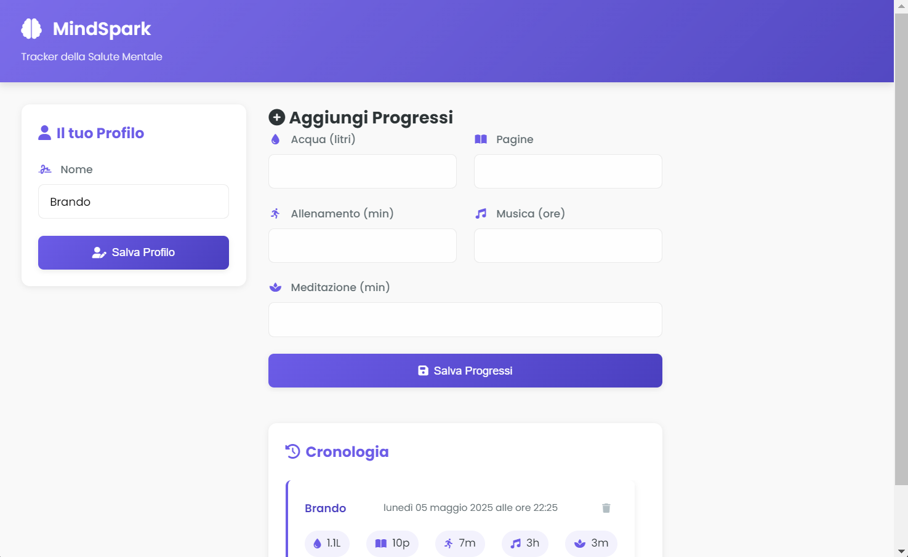

```markdown
MindSpark - Wellness Tracker
=============================



Applicazione desktop per il tracciamento delle abitudini quotidiane legate al benessere.

Funzionalità Implementate
--------------------------

**Tracciamento abitudini:**
- Acqua consumata (litri)
- Pagine lette
- Minuti di allenamento
- Ore di musica ascoltata
- Minuti di meditazione

**Gestione dati:**
- Salvataggio locale dei progressi (localStorage)
- Cronologia completa con eliminazione record
- Profilo utente personalizzabile

**Interfaccia:**
- Design responsive per diverse dimensioni schermo
- Visualizzazione dati con icone intuitive
- Formattazione data locale (italiano)
- Feedback visivi per azioni utente

Struttura del Codice
--------------------

```

mindspark/
├── index.html          # Struttura principale UI
├── renderer.js         # Logica applicativa
├── main.js             # Configurazione Electron
├── style.css           # Stili CSS completi
├── package.json        # Configurazione progetto
└── README.md           # Documentazione

```

Tecnologie Utilizzate
----------------------

**Frontend:**
- HTML5 semantico
- CSS3 con Flexbox/Grid
- JavaScript ES6+

**Librerie:**
- Font Awesome

Installazione
-------------

1. Clonare il repository:
```

git clone [https://github.com/biagio-scaglia/mindspark.git](https://github.com/biagio-scaglia/mindspark.git)
cd mindspark

```

2. Installare le dipendenze:
```

npm install

```

3. Avviare l'applicazione:
```

npm start

```

Note Tecniche
-------------

- Dati persistiti in localStorage
- Compatibile con Windows/macOS/Linux
- Interfaccia ottimizzata per:
- Desktop: ≥1024px
- Tablet: 768px-1023px
- Mobile: ≤767px

Licenza
-------

Distribuito sotto licenza MIT. Vedi `LICENSE` per dettagli.
```

Ora il documento è pulito, ben strutturato e privo di simboli extra!
